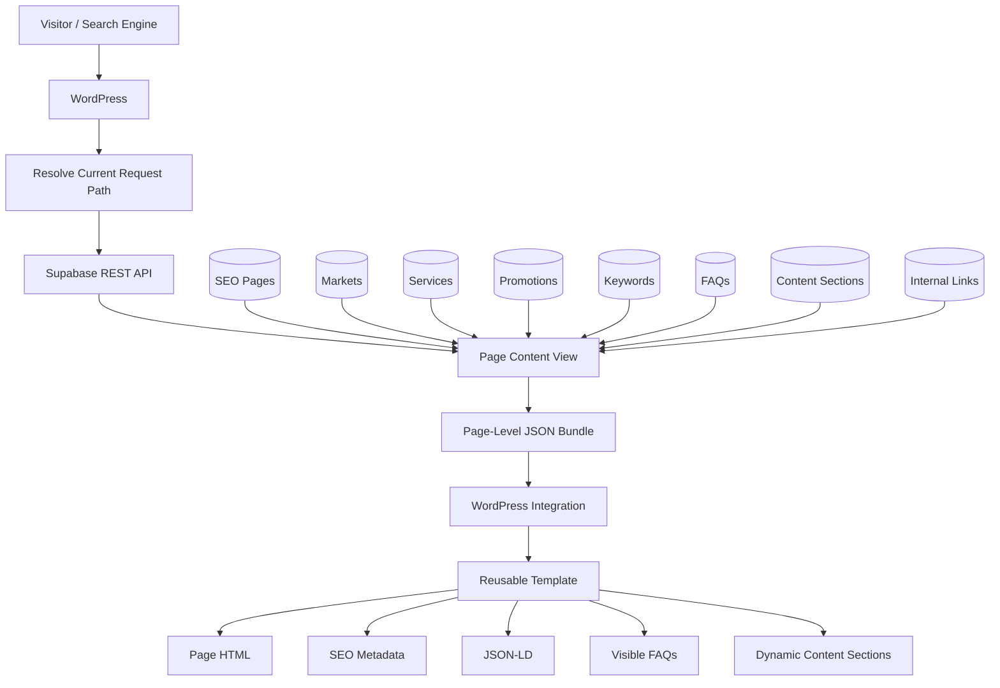

# SEO & AEO Content Platform

A database-driven SEO and Answer Engine Optimization platform I built to manage hierarchical, localized website content through PostgreSQL, Supabase, and reusable WordPress templates.

The system models website pages and their relationships in PostgreSQL, generates repeatable local SEO/AEO defaults, stores keywords, FAQs, content sections, internal links, services, markets, promotions, and redirects as structured data, assembles those records into page-level JSON documents, and makes the resulting content available to WordPress through a route-based API integration.

Instead of maintaining every localized page as a separate collection of hard-coded SEO fields and content blocks, the platform treats search content as structured application data.

> The complete production implementation remains private because it contains production credentials, internal market information, company-specific content, private infrastructure configuration, and operational business rules. This repository contains sanitized examples based on the real architecture.

---

## Overview

Localized websites become difficult to manage when every town, state, service, promotion, FAQ, title, description, internal link, and structured-data element is maintained independently inside WordPress.

I built this platform to separate three responsibilities:

```text
PostgreSQL / Supabase
        ↓
Structured Content + Relationships
        ↓
WordPress Integration
        ↓
Reusable Presentation Layer
```

The database owns the structured content model. The WordPress integration resolves the requested path and retrieves the matching page bundle. The reusable template renders the final page, metadata, FAQs, content sections, and JSON-LD.

At a high level:

```text
Visitor / Search Engine
        ↓
Requested URL
        ↓
WordPress
        ↓
Normalize Current Path
        ↓
Supabase REST
        ↓
Page Content View
        ↓
Structured Page Bundle
        ↓
Reusable WordPress Template
        ↓
HTML + SEO Metadata + JSON-LD
```

---

## What the Platform Manages

The content model supports:

- Website pages
- Geographic markets
- Services
- Promotions
- SEO keywords
- FAQs
- Content sections
- Internal links
- Redirects
- Parent/child page relationships
- Publishing status
- Robots directives
- Canonical URLs
- Open Graph metadata
- Answer-engine summaries
- Key answers
- Geographic scope
- Locality information
- Network technology
- Content-generation state
- Editorial SEO locking

This allows the system to treat SEO and AEO content as a connected content model rather than a set of unrelated WordPress fields.

---

## Technology

- PHP
- WordPress
- PostgreSQL
- PL/pgSQL
- Supabase
- REST APIs
- SQL views
- JSON / JSONB
- WordPress custom fields / ACF
- HTML
- Schema.org / JSON-LD
- SEO metadata
- AEO content structures
- Hierarchical content modeling

---

## Core Architecture



The architecture deliberately separates normalized relational storage from the page-oriented document consumed by WordPress.

---

## Hierarchical Page Model

The website structure is represented in the database rather than existing only as URL conventions.

```text
Homepage
   ↓
National / Service-Area Landing Page
   ↓
State Page
   ↓
Local Market Page
```

A page can include:

```text
id
page_name
page_type
slug
path
parent_page_id
hierarchy_level
geographic_scope
state_code
locality_name
locality_type
technology
```

The self-referencing `parent_page_id` relationship allows pages to be connected into a navigable hierarchy. The application can understand that a local market belongs beneath a state page and that a state page belongs beneath a national service-area page.

---

## Core Page Record

The main page record combines route identity, traditional SEO metadata, AEO content, publication state, hierarchy, and content governance.

```text
SEO Page
│
├── Route
│   ├── page_name
│   ├── page_type
│   ├── slug
│   └── path
│
├── SEO
│   ├── seo_title
│   ├── meta_description
│   ├── primary_keyword
│   ├── canonical_url
│   ├── robots_index
│   └── robots_follow
│
├── Page / AEO
│   ├── h1
│   ├── eyebrow
│   ├── intro_content
│   ├── answer_engine_summary
│   └── key_answer
│
├── Social
│   ├── og_title
│   ├── og_description
│   └── og_image_url
│
├── Publishing
│   ├── status
│   ├── published_at
│   └── active
│
├── Hierarchy / Local Context
│   ├── parent_page_id
│   ├── hierarchy_level
│   ├── geographic_scope
│   ├── state_code
│   ├── locality_name
│   ├── locality_type
│   └── technology
│
└── Governance
    ├── seo_locked
    └── content_generated_at
```

---

## Relational Content Model

Page content is normalized into related tables rather than stored as one large unstructured document.

```text
                         seo_pages
                             │
          ┌──────────────────┼───────────────────┐
          │                  │                   │
          ▼                  ▼                   ▼
 seo_page_keywords     seo_page_faqs     seo_content_sections
          │                  │                   │
          └──────────────────┼───────────────────┘
                             │
                             ▼
                    seo_internal_links
```

Pages can also reference markets, services, and promotions, while redirects are managed separately.

This structure allows each content type to have its own validation, ordering, active state, and behavior.

---

## Page Content View

WordPress does not need to reproduce the relational joins used by the database.

A PostgreSQL view assembles the related records into one page-oriented document.

```text
seo_pages
    +
seo_markets
    +
seo_services
    +
seo_promotions
    +
seo_page_keywords
    +
seo_page_faqs
    +
seo_content_sections
    +
seo_internal_links
        ↓
Page Content View
        ↓
One Structured JSON Response
```

The view uses PostgreSQL JSONB functions including `jsonb_build_object()`, `jsonb_agg()`, and `COALESCE()` to create ordered arrays such as:

```text
keywords[]
faqs[]
content_sections[]
internal_links[]
```

This gives the application a clean separation:

```text
PostgreSQL → Relational Model
Page View  → Page Document
WordPress  → Presentation
```

**[View the public SQL example →](examples/supabase-page-content-view.sql)**

---

## Database-Side Local Content Generation

The platform can generate repeatable SEO/AEO defaults for local market pages.

```text
Generate Local Content Bundle
             ↓
 ┌───────────┼────────────┬─────────────┐
 ▼           ▼            ▼             ▼
SEO       Keywords       FAQs        Sections
Defaults
```

Automatic generation validates that the target is the correct hierarchy level and geographic scope before applying local content rules.

**[View the PL/pgSQL example →](examples/local-content-generator.sql)**

---

## Editorial Locking

One of the important governance controls is `seo_locked`.

```text
Local Page
    ↓
seo_locked?
 /         \
Yes         No
 ↓           ↓
Preserve    Generate
Curated     Defaults
Content
```

Automatically generated defaults can therefore coexist with manually optimized pages. A curated page can be protected from bulk SEO regeneration without removing it from the broader content system.

---

## Technology-Aware Content

Local content can change according to network or service technology.

```text
Local Market
     ↓
Technology
 /      |       \
Fiber  Coax   Fiber + Coax
  ↓      ↓         ↓
Technology-Specific
SEO / AEO Content
```

The generation layer can use technology to determine appropriate SEO titles, H1 content, keywords, FAQs, content sections, answer-engine summaries, and key answers.

This allows one content architecture to support different local service conditions without creating a separate WordPress template for every technology combination.

---

## Keyword Model

Keywords are stored independently from the main page record and can include:

```text
keyword
keyword_type
search_intent
priority
active
```

This supports structured groups such as primary, secondary, long-tail, and question keywords, along with local, commercial, informational, and navigational search intent.

---

## FAQ / AEO Model

FAQs are structured records with fields such as:

```text
question
short_answer
detailed_answer
answer_type
display_order
include_on_page
include_in_schema
authoritative
source_reference
verified_at
active
```

Visible page content and structured-data eligibility can therefore be controlled separately.

```text
FAQ
 ├── include_on_page  → Visible HTML
 └── include_in_schema → JSON-LD
```

---

## Content Sections

Page body content is modeled as ordered sections.

```text
section_key
section_type
heading
subheading
content
display_order
active
```

The reusable WordPress template can render these sections from structured data rather than requiring every section to be hard-coded into a separate PHP template.

---

## Internal Linking

Internal links are stored as relationships rather than being embedded only inside page copy.

A link can reference another SEO page or a direct URL and can include anchor text, relationship type, priority, and active state.

```text
National Page
      ↓ child
State Page
      ↓ child
Local Page
      ↑ parent
State Page
```

This makes internal linking part of the content architecture instead of an incidental template detail.

---

## Supabase REST Layer

The page-content view is exposed through Supabase. The WordPress integration resolves the current request path and requests the matching active, published record.

```text
WordPress Request
        ↓
/national/example-state/example-town/
        ↓
Normalize Path
        ↓
Supabase REST
        ↓
path = requested path
active = true
status = published
        ↓
Matching Page Bundle
```

**[View the public PHP client →](examples/seo-content-client.php)**

---

## Safe Failure Behavior

The WordPress page does not depend entirely on a successful remote content lookup.

```text
Request Structured Page
       ↓
Successful?
   /          \
 Yes           No
  ↓             ↓
Use Bundle   WordPress
             Fallback
```

Reusable WordPress fields can provide fallback values when the Supabase layer is unavailable or a route does not yet have a published record.

---

## WordPress Template Layer

The reusable template combines WordPress page context, local fallback fields, and the structured Supabase page bundle.

It can use database-driven values for:

- SEO title
- Meta description
- H1
- Canonical URL
- Robots directives
- Open Graph metadata
- Technology
- Content sections
- FAQs
- JSON-LD

**[View the simplified reusable template →](examples/simplified-local-town-template.php)**

---

## Structured Data

The structured-data layer builds JSON-LD from the same page bundle used by the page renderer.

The public example demonstrates `WebPage`, `Service`, and `FAQPage` schema and respects `include_in_schema` independently from visible FAQ rendering.

```text
Page Bundle
     ↓
SEO Metadata
     ↓
Locality / Technology
     ↓
Schema-Eligible FAQs
     ↓
JSON-LD Graph
```

**[View the structured-data example →](examples/structured-data-builder.php)**

---

## Implementation Examples

The production platform remains private, but the repository includes sanitized examples of the main implementation patterns:

- **[PostgreSQL page aggregation →](examples/supabase-page-content-view.sql)**
- **[PL/pgSQL local content generation →](examples/local-content-generator.sql)**
- **[WordPress / Supabase client →](examples/seo-content-client.php)**
- **[Structured-data builder →](examples/structured-data-builder.php)**
- **[Reusable local template →](examples/simplified-local-town-template.php)**
- **[Synthetic page record →](examples/sample-page-record.json)**
- **[Synthetic API response →](examples/sample-api-response.json)**
- **[Synthetic rendered page →](examples/sample-rendered-page.md)**
- **[Implementation examples README →](examples/README.md)**

---

## Example End-to-End Flow

```text
Synthetic Page Record
        ↓
Page Content View
        ↓
Page-Oriented JSON Bundle
        ↓
Supabase REST
        ↓
SEO Content Client
        ↓
Reusable WordPress Template
        ↓
Structured Data Builder
        ↓
Rendered HTML + Metadata + JSON-LD
```

The database remains normalized for management and integrity while the presentation layer receives a page-shaped document.

---

## Practical Benefits

The architecture reduces several common problems associated with large localized websites:

- Repetitive manual page creation
- SEO fields scattered across templates
- Duplicate market content
- Inconsistent titles and headings
- Hard-coded local FAQs
- Difficult bulk updates
- Content tightly coupled to PHP templates
- Manual internal-link maintenance
- Uncontrolled automatic content overwrites
- Separate API requests for every related content type

Instead, the platform provides:

```text
One Structured Content Model
        +
One Page Aggregation Layer
        +
One Route-Based Integration
        +
Reusable Templates
```

---

## My Role

I designed and built the platform around an existing WordPress website and localized service-area structure.

My work included:

- Designing the PostgreSQL SEO/AEO content model
- Designing the hierarchical page structure
- Modeling parent/child page relationships
- Creating structured content tables
- Developing PL/pgSQL generation functions
- Designing technology-aware local content rules
- Implementing editorial SEO locking
- Building the aggregated page-content view
- Working with PostgreSQL JSONB
- Connecting WordPress to Supabase
- Building route-based page resolution
- Developing the WordPress integration layer
- Building reusable local templates
- Implementing dynamic fallback behavior
- Rendering database-driven content sections
- Building FAQ and structured-data handling
- Implementing canonical, robots, and Open Graph metadata
- Testing API connectivity
- Troubleshooting route and content resolution
- Separating production configuration from source code
- Designing the platform so additional local pages can use the same workflow

The project combines marketing strategy with database design, content architecture, APIs, PHP development, SEO engineering, and automation.

---

## Source Code & Production Data

The complete production implementation remains private because it contains:

- Production database access
- Private Supabase configuration
- Internal website configuration
- Real market records
- Company-specific SEO/AEO content
- Production promotion and pricing information
- Internal service rules
- Operational routing logic
- Private integrations
- Production credentials

The examples in this repository have been simplified, renamed, and sanitized. All public sample records are synthetic.

---

## Technical Documentation

For a deeper look at the system:

- **[System Architecture →](docs/architecture.md)**  
  WordPress integration, Supabase content storage, path resolution, request flow, failure handling, and page-rendering architecture.

- **[Technical Overview →](docs/technical-overview.md)**  
  Implementation concepts covering PHP, REST requests, Supabase, PostgreSQL, content modeling, structured data, security, testing, and scalability.

- **[Implementation Examples →](examples/README.md)**  
  Sanitized SQL, PL/pgSQL, PHP, JSON, and rendered examples showing the main implementation patterns.

---

## Summary

The platform turns SEO/AEO content into structured application data.

```text
Hierarchical Website Model
        ↓
PostgreSQL / Supabase
        ↓
SEO + AEO Content Generation
        ↓
Relational Content
        ↓
Page Content View
        ↓
Page-Level JSON
        ↓
Route-Based WordPress Integration
        ↓
Reusable Template
        ↓
SEO Metadata + Content + JSON-LD
```

What began as a localized website-content problem became a reusable content platform that connects marketing strategy, database design, automation, APIs, and WordPress application logic.
