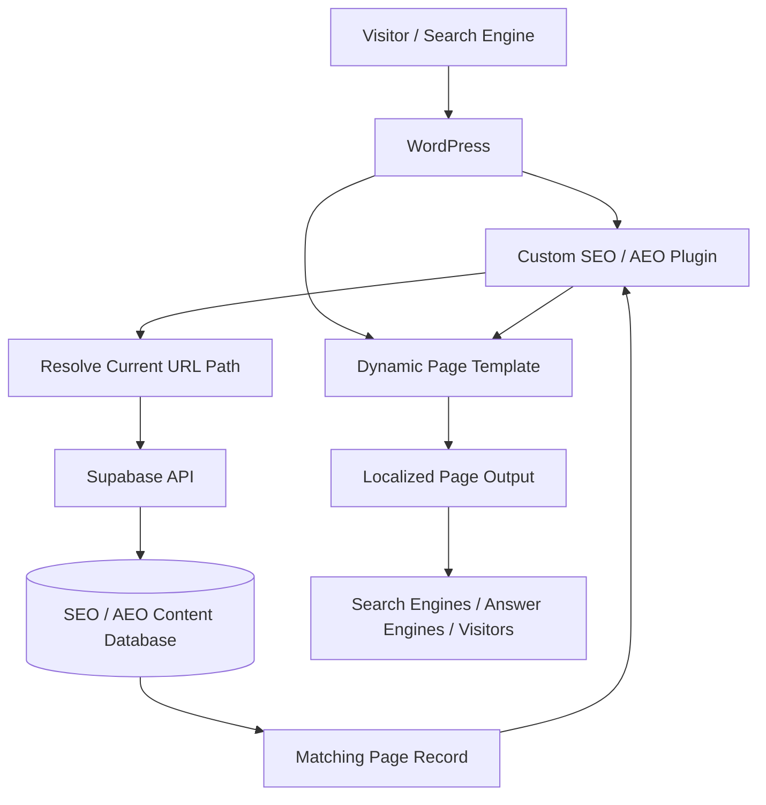
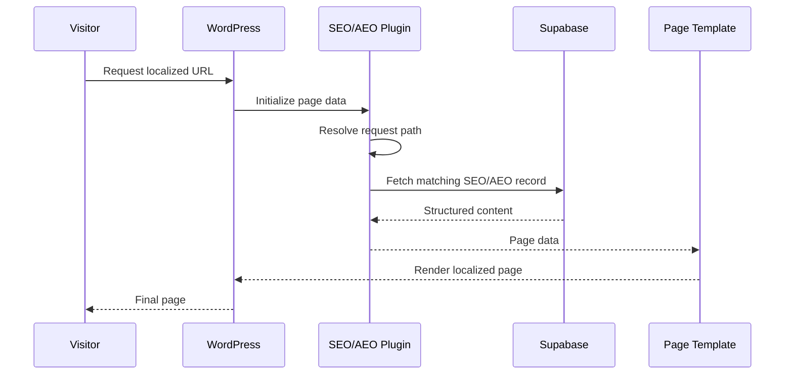

# SEO & AEO Content Platform

A database-driven SEO and Answer Engine Optimization platform built to manage localized website content through WordPress without manually maintaining every market page.

The system connects WordPress to structured content stored in Supabase. A custom WordPress plugin identifies the current page path, retrieves the matching SEO/AEO record, and makes that data available to the page and template layer.

This allows localized service pages to use consistent, structured content while keeping the underlying website template reusable.

> Production source code, credentials, internal market data, and company-specific content rules are maintained privately. This repository documents the architecture and technical approach without exposing production systems.

---

## Overview

The project started with a common problem: localized website pages need different titles, headings, service information, FAQs, and other search-oriented content, but maintaining each page individually becomes difficult as the number of markets grows.

Instead of building every page as a completely separate WordPress page, I built a system where the page structure stays reusable and the market-specific SEO/AEO content is stored as structured data.

At a high level:

```text
Requested Website URL
        ↓
WordPress
        ↓
Custom SEO / AEO Plugin
        ↓
Resolve Current Path
        ↓
Supabase Lookup
        ↓
Market-Specific Content
        ↓
Reusable WordPress Template
        ↓
Localized Search-Optimized Page
```

---

## What the Platform Does

The platform separates three concerns:

### Page Structure

WordPress controls the page and template experience.

### Content Data

Supabase stores the structured SEO/AEO content associated with each route or market.

### Retrieval Logic

The custom plugin connects the requested WordPress path to the correct Supabase record.

That makes the content system data-driven instead of requiring every SEO field to be manually embedded into page templates.

---

## Example Request Flow

A page request might look like:

```text
/national/pennsylvania/example-fiber/
```

The plugin resolves the current path and requests the matching record from Supabase.

Conceptually, the returned data can include values such as:

```text
Path
Technology
SEO Title
Primary Heading
Page-Level SEO / AEO Content
```

The exact production content model contains additional fields that are not included in this public showcase.

---

## High-Level Architecture



---

## Why I Built It

Localized broadband pages need to reflect the specific market being served.

Without a structured system, that can lead to:

- Repetitive manual page creation
- Inconsistent titles and headings
- Content becoming difficult to update
- Market data being duplicated across WordPress
- Changes requiring edits across many individual pages
- SEO content becoming tightly coupled to the page template

The platform moves market-specific search content into a data layer and lets WordPress focus on presentation.

---

## WordPress Integration

The WordPress side is handled through a custom plugin.

Its core responsibility is to:

```text
Detect current page
      ↓
Determine page path
      ↓
Request matching content
      ↓
Validate response
      ↓
Expose content to WordPress
```

A simplified public example might look like:

```php
function get_seo_page_data($path) {
    // Request the matching page record
    // from the configured content API.

    return $page_data;
}
```

The production plugin contains additional handling and configuration that remain private.

---

## Supabase Content Layer

Supabase acts as the structured content source.

Conceptually:

```text
seo_pages
├── path
├── technology
├── seo_title
├── h1
└── additional structured content
```

A page can therefore be resolved by its path instead of relying on hard-coded content inside the WordPress template.

---

## Path-Based Content Resolution

The current website path becomes the lookup key.

Conceptually:

```text
WordPress Request
/national/pennsylvania/example-fiber/
              ↓
Normalize Path
              ↓
Supabase Query
              ↓
Matching Record
```

This makes the system suitable for a large number of localized routes.

---

## Technology-Aware Content

The content model can distinguish between service technologies or page types.

For example:

```text
Market
    +
Technology
    ↓
Appropriate Search Content
```

This allows the same underlying template architecture to support pages with different service characteristics without creating completely separate template systems.

---

## Separation of Content and Presentation

One of the main design decisions was keeping the page template separate from the content source.

```text
WordPress Template
        ≠
Market Content
```

Instead:

```text
Reusable Template
        +
Structured Market Record
        ↓
Rendered Local Page
```

This makes the website easier to update and reduces duplicated content-management work.

---

## Data-Driven Page Model

The system can be thought of as:

```text
Route
  ↓
Structured Record
  ↓
Template
  ↓
Rendered Page
```

That is closer to an application/data model than a traditional collection of manually maintained WordPress pages.

---

## SEO & AEO

The platform was designed to support both traditional search optimization and increasingly structured answer-oriented content.

The data layer makes it possible to manage page-specific information consistently instead of scattering it throughout templates.

Areas the system is designed around include:

- Page-specific SEO titles
- Primary page headings
- Market-specific content
- Technology-aware content
- Structured page information
- Search-oriented content organization
- Reusable localized page architecture

---

## Example Data Flow



---

## Error Handling

The integration needs to handle situations where the external content source is unavailable or a route does not have a matching record.

Conceptually:

```text
Request Page Data
      ↓
Record Found?
   /        \
 Yes        No
  ↓          ↓
Use Data   Safe Fallback
```

The WordPress page should not fail completely simply because an SEO content lookup does not return the expected result.

---

## Configuration

Connection information is kept outside the public codebase.

Conceptually:

```php
define('SEO_CONTENT_API_URL', 'configured-outside-source');
define('SEO_CONTENT_API_KEY', 'configured-outside-source');
```

Production credentials are never included in this repository.

---

## Practical Benefits

The platform reduces the amount of manual work required to maintain localized website content.

It provides:

- One reusable page architecture
- Centralized structured SEO/AEO content
- Consistent page-level fields
- Easier market updates
- Less duplicated WordPress content
- Cleaner separation between data and presentation
- A foundation that can scale as more localized routes are added

---

## Technical Areas

The project includes work across:

- PHP
- WordPress
- Supabase
- PostgreSQL
- REST APIs
- HTML / CSS
- Dynamic templates
- Route-based content lookup
- Data modeling
- Error handling
- Environment configuration
- SEO architecture
- AEO content structure

---

## My Role

I designed and built the system around an existing WordPress website and localized page structure.

My work included:

- Designing the SEO/AEO content model
- Building the Supabase-backed content layer
- Developing the custom WordPress integration
- Implementing path-based page lookup
- Connecting WordPress to Supabase
- Testing API connectivity
- Handling route-specific content
- Separating market data from presentation logic
- Working with dynamic page templates
- Troubleshooting data retrieval and rendering
- Managing production configuration separately from source code
- Designing the platform so additional local pages can use the same workflow

---

## Source Code & Production Data

The production implementation remains private because it contains:

- Internal website configuration
- Production database access
- Proprietary market data
- Company-specific SEO/AEO content
- Private API configuration
- Production page rules

This repository focuses on the architecture and engineering approach rather than exposing production infrastructure.

---

## Technical Documentation

For a deeper look at the system:

- **[System Architecture →](docs/architecture.md)**  
  WordPress integration, Supabase content storage, path resolution, request flow, configuration, failure handling, and page rendering architecture.

- **[Technical Overview →](docs/technical-overview.md)**  
  Implementation concepts covering PHP plugin design, REST requests, Supabase queries, content modeling, caching considerations, error handling, security, testing, and scalability.

---

## Summary

The platform turns localized SEO content into structured application data.

```text
Localized URL
      ↓
WordPress
      ↓
Custom Plugin
      ↓
Supabase
      ↓
Structured SEO / AEO Record
      ↓
Reusable Template
      ↓
Localized Web Page
```

What started as a website content problem became a reusable system for managing localized search content through data, APIs, and application logic.
