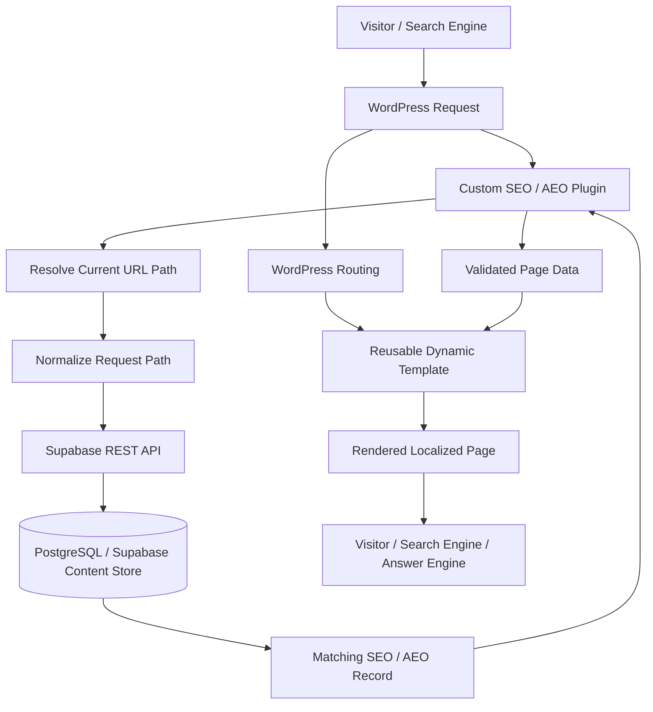
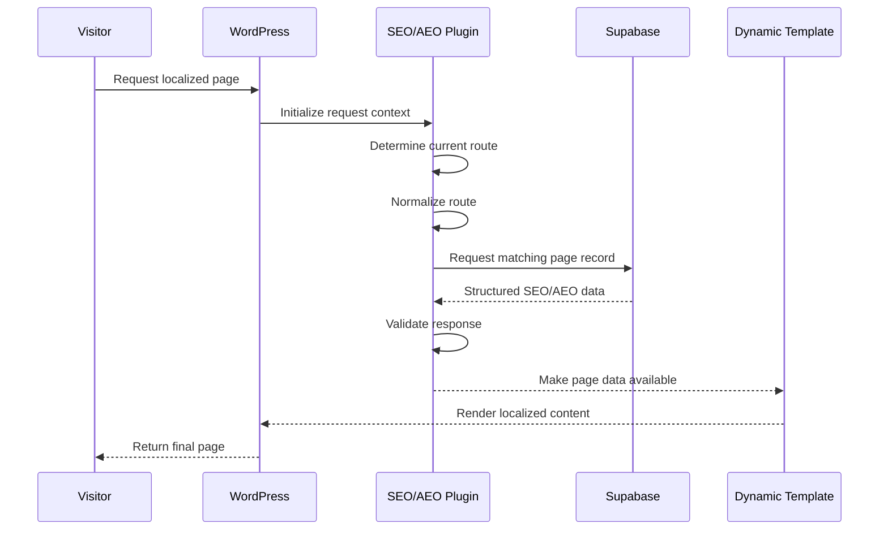

# SEO & AEO Content Platform — System Architecture

## Purpose

The SEO & AEO Content Platform separates localized search content from WordPress page templates.

Instead of maintaining every market page as a standalone content object, the system uses:

- WordPress for page delivery and reusable templates
- A custom PHP plugin for route-aware data retrieval
- Supabase/PostgreSQL for structured SEO/AEO content
- REST-based communication between WordPress and the data layer

The architecture is designed to make localized service pages easier to manage, update, scale, and keep consistent.

This document explains the public architecture of the platform. Production credentials, proprietary content, internal market data, exact table definitions, private endpoints, and company-specific business rules are intentionally excluded.

---

# 1. High-Level Architecture



The core architectural idea is:

```text
Route
  ↓
Structured Content Record
  ↓
Reusable Template
  ↓
Rendered Local Page
```

---

# 2. Architectural Responsibilities

The system is divided into three major layers.

## WordPress

Responsible for:

- Page routing
- Template rendering
- Existing site layout
- Theme behavior
- Front-end presentation

## Custom Plugin

Responsible for:

- Identifying the current route
- Normalizing the route
- Requesting the correct content record
- Validating the response
- Making structured content available to WordPress
- Handling missing or failed lookups safely

## Supabase / PostgreSQL

Responsible for:

- Storing localized SEO/AEO content
- Mapping content to routes
- Returning structured page records
- Separating data from WordPress presentation logic

---

# 3. Request Lifecycle

A typical page request follows this sequence:



---

# 4. Route-Based Content Resolution

The route acts as the main lookup key.

Example:

```text
/national/pennsylvania/example-fiber/
```

becomes:

```text
normalized_path
        ↓
Supabase lookup
        ↓
matching page record
```

This design allows one template to support many localized URLs.

---

# 5. Path Normalization

Path normalization is important because equivalent routes can appear in slightly different forms.

Examples:

```text
/national/pennsylvania/example-fiber
/national/pennsylvania/example-fiber/
/NATIONAL/PENNSYLVANIA/EXAMPLE-FIBER/
```

A normalization layer can standardize:

- Leading slash
- Trailing slash
- Case
- Encoded characters
- Query-string exclusion
- Duplicate slashes

The goal is to ensure one logical page maps to one stable lookup value.

---

# 6. Content Record Model

A simplified page record can conceptually contain:

```text
SEO Page Record
├── Path
├── Technology
├── SEO Title
├── Primary Heading
├── Page Copy
├── Search-Oriented Content
├── FAQ Content
├── Structured Content Fields
└── Additional Page Metadata
```

The exact production schema is intentionally not published.

---

# 7. Content Separation

The architecture deliberately separates:

```text
Presentation
```

from:

```text
Market-Specific Data
```

Instead of embedding every field directly into WordPress templates:

```text
Template
    +
Structured Record
    ↓
Rendered Page
```

This reduces duplication and makes updates easier.

---

# 8. Dynamic Template Layer

The WordPress template is responsible for rendering the page using the content supplied by the plugin.

Conceptually:

```php
$page = get_seo_page_data();

if ($page) {
    echo esc_html($page['h1']);
}
```

This example is simplified and does not represent the production implementation.

---

# 9. WordPress Plugin Layer

The plugin acts as the integration layer between WordPress and Supabase.

Conceptually:

```text
WordPress Request
      ↓
Plugin
      ↓
Resolve Path
      ↓
Call API
      ↓
Validate Data
      ↓
Expose Page Record
```

The plugin prevents the template layer from needing to know how Supabase is queried.

---

# 10. Plugin Responsibilities

The plugin can conceptually handle:

- Path detection
- Route normalization
- API request construction
- Authentication headers
- Timeout handling
- HTTP status handling
- JSON parsing
- Missing-record behavior
- Response validation
- Safe fallback behavior
- Optional caching

---

# 11. Supabase API Layer

The plugin communicates with Supabase through a configured API endpoint.

Conceptually:

```text
WordPress
    ↓
HTTPS Request
    ↓
Supabase REST Layer
    ↓
PostgreSQL
```

The production endpoint and credentials are intentionally not included in the public repository.

---

# 12. Database Layer

Supabase provides the structured content source.

Conceptually:

```text
seo_pages
├── path
├── technology
├── seo_title
├── h1
├── content fields
├── structured answer fields
└── metadata
```

The route is used to retrieve the relevant record.

---

# 13. Simplified Query Model

Conceptually, the request is equivalent to:

```sql
SELECT *
FROM seo_pages
WHERE path = :current_path
LIMIT 1;
```

This is a public example only.

The production implementation may use views, functions, filters, or additional constraints.

---

# 14. Technology-Aware Pages

The platform can distinguish page content based on network or service technology.

Conceptually:

```text
Route
+
Technology Context
      ↓
Appropriate Page Record
```

Examples of technology categories might include:

```text
Fiber
Coax
Fiber + Coax
Other configured service types
```

The exact production values are private.

---

# 15. Market-Aware Content

Localized pages can contain content relevant to:

- City
- State
- Service technology
- Available services
- Market positioning
- Local headings
- Local FAQs
- Search metadata

The database model allows these variations without creating a completely different WordPress template for each market.

---

# 16. SEO Metadata

The structured record can provide page-level SEO metadata such as:

```text
SEO Title
Page Heading
Meta Description
Canonical Context
Structured Content
```

The exact fields depend on the implementation.

---

# 17. AEO-Oriented Content

The data model can also support content designed to answer common user questions clearly and consistently.

This can include:

- Direct answers
- FAQs
- Service explanations
- Availability context
- Technology explanations
- Market-specific information

The architecture makes these fields centrally manageable.

---

# 18. Structured Content

A database-backed model makes it easier to represent content as structured fields rather than one large body of HTML.

Conceptually:

```text
Page
├── Title
├── H1
├── Intro
├── Service Summary
├── FAQ 1
├── FAQ 2
├── FAQ 3
└── Additional Sections
```

This creates more control over rendering and reuse.

---

# 19. API Request Flow

A simplified request pattern:

```php
$response = wp_remote_get(
    $endpoint,
    [
        'headers' => [
            'apikey' => $api_key,
        ],
        'timeout' => 5,
    ]
);
```

Production authentication details are intentionally excluded.

---

# 20. Response Handling

The integration should not assume every API request succeeds.

Conceptually:

```text
HTTP Request
      ↓
Transport Error?
  /          \
Yes          No
 ↓            ↓
Fallback    HTTP Status Check
                 ↓
             Valid JSON?
              /     \
            No       Yes
            ↓         ↓
         Fallback   Validate Record
```

---

# 21. Missing Record Handling

A valid API response may still contain no matching page.

That is different from a network failure.

Conceptually:

```text
Request succeeded
      ↓
Record found?
   /       \
 Yes       No
  ↓         ↓
Render   Fallback behavior
```

This distinction helps with debugging.

---

# 22. Safe Fallback Design

The SEO/AEO integration should enhance the page rather than make the entire website dependent on one API call.

If the data source is unavailable, WordPress can still:

- Render a safe default
- Use existing page content
- Avoid exposing errors to visitors
- Log the failure for review

The exact production fallback behavior is private.

---

# 23. Configuration Architecture

Sensitive connection information is stored outside public source code.

Conceptually:

```php
define('SEO_SUPABASE_URL', getenv('SEO_SUPABASE_URL'));
define('SEO_SUPABASE_KEY', getenv('SEO_SUPABASE_KEY'));
```

or equivalent WordPress configuration.

---

# 24. Secrets Management

The repository should never contain:

- Supabase service keys
- API secrets
- WordPress credentials
- Production database passwords
- Private environment variables

Only placeholder examples belong in public documentation.

---

# 25. Least-Privilege Access

The WordPress integration should use only the level of database/API access required for content retrieval.

Conceptually:

```text
WordPress
   ↓
Read SEO/AEO Records
```

It should not need broad administrative access to unrelated data.

---

# 26. Read-Oriented Architecture

The front-end page-rendering path is primarily read-oriented.

```text
Request
  ↓
Lookup
  ↓
Render
```

Content creation and maintenance can be handled separately from live page requests.

This separation reduces the number of responsibilities inside the public-facing WordPress runtime.

---

# 27. Content Publishing Model

Conceptually:

```text
Content Created / Updated
        ↓
Supabase Record
        ↓
Available to WordPress
        ↓
Next Page Request
        ↓
Updated Content Rendered
```

This makes content changes data-driven.

---

# 28. Scaling Local Pages

The architecture is designed so adding another localized route does not require a new application architecture.

Conceptually:

```text
New Market
    ↓
Add Structured Record
    ↓
Use Existing Template
    ↓
New Local Page
```

This is one of the main benefits of separating content and presentation.

---

# 29. Consistency

A structured model makes it easier to maintain consistency across:

- Titles
- Headings
- Content sections
- FAQ structure
- Technology labels
- Market fields
- Metadata

Instead of relying on manual page-by-page formatting.

---

# 30. Content Validation

Before a record is considered publishable, validation can check for:

- Required path
- SEO title
- Primary heading
- Valid technology value
- Required content sections
- Correct route format
- Duplicate routes

The exact production validation rules are private.

---

# 31. Unique Route Constraint

A strong data model should prevent multiple active records from unintentionally claiming the same route.

Conceptually:

```text
path = unique
```

or an equivalent uniqueness rule.

This prevents ambiguous rendering.

---

# 32. Data Types

Structured content fields can use different data types.

Examples:

```text
Text
Boolean
JSON
Arrays
Identifiers
Timestamps
```

JSON fields can be useful when storing repeated structured content such as FAQ collections.

---

# 33. JSON Content Structures

A FAQ block might conceptually be stored as:

```json
[
  {
    "question": "What internet service is available?",
    "answer": "Service availability depends on the exact address."
  }
]
```

This allows WordPress to render repeated content predictably.

---

# 34. Rendering Structured FAQs

The template layer can iterate through structured data.

Conceptually:

```php
foreach ($page['faqs'] as $faq) {
    // Render question and answer
}
```

The production implementation may use a different structure.

---

# 35. Schema Evolution

As page requirements grow, the content model may need new fields.

Examples:

```text
New SEO field
New answer-engine content block
New technology attribute
New market field
New schema metadata
```

Database migrations should handle structural changes rather than ad hoc manual edits.

---

# 36. Backward Compatibility

When new fields are introduced, older records may not contain them immediately.

Templates should therefore distinguish between:

```text
Required Field
Optional Field
```

Optional content should fail gracefully when absent.

---

# 37. Caching Considerations

Calling an external data source on every page request can introduce unnecessary latency.

Possible caching layers include:

- WordPress object cache
- Transients
- Application-level cache
- Edge/CDN cache
- Preloaded route data

The correct strategy depends on how often the content changes.

---

# 38. Cache Tradeoffs

Caching introduces a balance:

```text
Long Cache
  → Faster requests
  → Slower content updates

Short Cache
  → Fresher content
  → More API requests
```

A content platform should choose a cache duration appropriate to editorial frequency.

---

# 39. Cache Key Design

A route-based cache can conceptually use:

```text
seo_page:/national/pennsylvania/example-fiber/
```

This keeps page records isolated.

---

# 40. Cache Invalidation

When content changes, stale cached data should eventually be replaced.

Possible approaches include:

- TTL expiration
- Manual invalidation
- Deployment invalidation
- Update-triggered invalidation

The production strategy is intentionally not disclosed.

---

# 41. Performance

The live page path should minimize:

- Unnecessary API calls
- Large responses
- Repeated parsing
- Repeated route normalization
- Unneeded database fields

Fetching only the content needed by the template reduces overhead.

---

# 42. API Timeout Strategy

External requests should have a defined timeout.

Without one, a slow API can delay page rendering.

Conceptually:

```text
Request Supabase
      ↓
Respond within limit?
   /         \
 Yes         No
  ↓           ↓
Use Data    Fallback
```

---

# 43. Error Logging

Failures should be visible to maintainers without being shown to site visitors.

Useful logging can include:

```text
Timestamp
Requested path
HTTP status
Failure category
Missing record
Parsing failure
Timeout
```

Sensitive credentials or full private payloads should not be logged.

---

# 44. Error Categories

Conceptual categories include:

```text
ROUTE_INVALID
API_TIMEOUT
API_CONNECTION_ERROR
API_HTTP_ERROR
JSON_PARSE_ERROR
PAGE_NOT_FOUND
PAGE_DATA_INVALID
CONFIGURATION_MISSING
```

---

# 45. Observability

Operational visibility can answer questions such as:

- Which route failed?
- Was Supabase reachable?
- Did a record exist?
- Was the response malformed?
- Was required configuration missing?

This speeds troubleshooting.

---

# 46. Search Engine Rendering

Because the final content is rendered server-side through WordPress, search engines receive the completed page output rather than relying entirely on browser-side JavaScript.

This is useful for search-oriented content delivery.

---

# 47. Answer Engine Readability

Structured page content helps support clear, direct answers because content fields can be intentionally organized around specific questions and topics.

The architecture does not depend on a single large unstructured text field.

---

# 48. Template Reuse

One template can support many routes:

```text
Template
├── Market A Data
├── Market B Data
├── Market C Data
└── Market D Data
```

This reduces duplicated layout logic.

---

# 49. Separation From ACF / Existing Dynamic Data

The SEO/AEO system can coexist with an existing dynamic WordPress architecture.

Conceptually:

```text
Existing WordPress / ACF Data
           +
SEO / AEO Supabase Data
           ↓
Dynamic Template
```

The SEO/AEO layer does not need to replace every existing content source.

---

# 50. Integration Boundary

The plugin provides a clean boundary between WordPress and Supabase.

The template should not need to know:

- Supabase credentials
- REST syntax
- Authentication headers
- HTTP response codes
- Data-fetch retry logic

It receives page data in an application-friendly structure.

---

# 51. Testing Strategy

Testing should cover several layers.

## Route Tests

- Valid route
- Trailing slash
- Missing slash
- Query strings
- Unexpected characters

## API Tests

- Successful response
- Missing record
- HTTP error
- Timeout
- Invalid JSON

## Content Tests

- Missing title
- Missing H1
- Invalid technology
- Optional field missing
- Duplicate route

## Rendering Tests

- Expected title
- Expected H1
- FAQ rendering
- Fallback content
- HTML escaping

---

# 52. Integration Test Flow

A small integration test can conceptually perform:

```text
Test Route
   ↓
Mock / Test Supabase Record
   ↓
Plugin Lookup
   ↓
Template Data
   ↓
Expected Rendered Fields
```

---

# 53. Security Testing

Security checks can include:

- Credential absence from repository
- Escaping rendered content
- Sanitizing route input
- Restricting database access
- Avoiding arbitrary query construction
- Preventing secret exposure in logs

---

# 54. Input Sanitization

The current URL path is external input.

It should be normalized and validated before being included in a database/API query.

Conceptually:

```text
Raw Request Path
      ↓
Normalize
      ↓
Sanitize
      ↓
Encode for API
```

---

# 55. Output Escaping

Structured content returned from the data layer still needs proper output handling.

Depending on field type:

```text
Plain text → escape
Trusted structured HTML → controlled handling
URL → URL escape
Attribute → attribute escape
```

This is standard WordPress security practice.

---

# 56. Content Trust Boundary

The database is a managed source, but the rendering layer should still avoid assuming all content is automatically safe in every HTML context.

The template controls how each field is rendered.

---

# 57. Database Security

The database layer should enforce appropriate access policies.

The public WordPress integration only needs access to the content required for public page rendering.

Sensitive unrelated data should remain inaccessible.

---

# 58. Production Configuration

Production configuration can include:

```text
Supabase URL
API key
Environment identifier
Timeout value
Cache settings
Feature flags
```

These values belong in environment/configuration management, not source code.

---

# 59. Development vs. Production

The platform benefits from separating environments.

Conceptually:

```text
Development WordPress
      ↓
Development Content Store

Production WordPress
      ↓
Production Content Store
```

This allows testing without affecting live pages.

---

# 60. Deployment Model

A plugin update follows the WordPress deployment workflow.

Database/content changes follow the Supabase content workflow.

These are separate deployment concerns:

```text
Code Deployment
      ≠
Content Update
```

That separation is useful operationally.

---

# 61. Content Changes Without Plugin Deployment

A major benefit is that updating a page record does not necessarily require changing PHP.

```text
Change SEO Title
      ↓
Update Supabase Record
      ↓
Page Uses New Data
```

This reduces unnecessary code deployments.

---

# 62. Code Changes Without Rewriting Content

Likewise, template or plugin improvements can be deployed without manually recreating every local page record.

---

# 63. Data Migration Strategy

Changes to the content schema should be handled deliberately.

Conceptually:

```text
Migration
   ↓
Add New Field
   ↓
Backfill Existing Records
   ↓
Update Plugin / Template
```

This avoids inconsistent page behavior.

---

# 64. Localized Page Scale

The architecture is designed for growth in route count.

As more markets are added:

```text
10 Pages
100 Pages
1,000 Pages
```

the fundamental request flow stays the same.

The primary scaling concerns shift toward:

- Content quality
- Data validation
- Query performance
- Caching
- Editorial workflow

rather than template duplication.

---

# 65. Indexing

The route lookup field should be indexed appropriately in the database.

Conceptually:

```sql
CREATE INDEX ...
ON seo_pages(path);
```

This is illustrative only.

Fast route lookups become increasingly important as page count grows.

---

# 66. Unique Path Enforcement

A uniqueness constraint on normalized path can protect the lookup model.

Conceptually:

```sql
UNIQUE(normalized_path)
```

The exact production schema may differ.

---

# 67. Data Quality

Useful content quality checks can include:

```text
Missing SEO title
Missing H1
Duplicate path
Missing market
Missing technology
Empty FAQ
Invalid route
Unpublished content
```

This helps prevent incomplete pages from reaching production.

---

# 68. Content Status

A structured system can conceptually support lifecycle fields such as:

```text
Draft
Review
Published
Archived
```

The exact production workflow is not disclosed.

---

# 69. Auditability

Centralized records make it easier to track:

- What content exists
- Which route it belongs to
- When it changed
- Whether required fields are populated

This is more manageable than searching through a large number of individually edited WordPress pages.

---

# 70. Extensibility

The architecture can support future additions such as:

- Schema markup
- FAQ JSON-LD
- Service-specific content blocks
- Comparison content
- Local structured data
- Offer metadata
- Internal-link recommendations
- Market-specific callouts
- AI-assisted content generation with review
- Search performance feedback loops

---

# 71. Future Analytics Integration

A future layer could connect search-performance data back to the content records.

Conceptually:

```text
Search Performance
      ↓
Route
      ↓
Content Record
      ↓
Optimization Decision
```

This would connect publishing and measurement.

---

# 72. Why This Is More Than a WordPress Plugin

The plugin is only one component.

The full system includes:

```text
Data Modeling
+
Database Architecture
+
API Integration
+
Route Resolution
+
WordPress Integration
+
Dynamic Rendering
+
SEO/AEO Content Design
+
Error Handling
+
Security
+
Scalability
```

It is a small content platform built around WordPress rather than a standalone PHP utility.

---

# 73. Architectural Principles

## Separate Content From Presentation

Market content should not be hard-coded into templates.

## Use Stable Routes as Keys

A normalized path provides a predictable mapping between website URLs and content records.

## Keep the Template Reusable

Adding a market should not require duplicating the entire presentation layer.

## Fail Gracefully

A data lookup problem should not automatically break the website.

## Keep Secrets Outside Source Control

Production credentials belong in configuration.

## Validate Structured Content

Required fields should be checked before rendering.

## Design for Growth

The same architecture should support more markets without a redesign.

---

# 74. Public Documentation Scope

This document intentionally includes:

- WordPress request architecture
- Custom plugin responsibilities
- Route normalization
- Supabase integration
- Structured content modeling
- Dynamic template behavior
- Error handling
- Security concepts
- Caching considerations
- Scalability
- Testing strategy

It intentionally excludes:

- Production credentials
- Exact Supabase URLs
- Exact table schemas
- Proprietary SEO/AEO content
- Internal market lists
- Private WordPress configuration
- Exact production queries
- Company-specific rules

---

## Summary

The SEO & AEO Content Platform turns localized website content into structured application data.

```text
Localized URL
      ↓
WordPress
      ↓
Route Resolution
      ↓
Custom Plugin
      ↓
Supabase / PostgreSQL
      ↓
Structured SEO / AEO Record
      ↓
Reusable Dynamic Template
      ↓
Localized Search-Optimized Page
```

The architecture provides a scalable bridge between WordPress presentation and a structured content database, allowing localized search content to be managed consistently without rebuilding page logic for every market.
