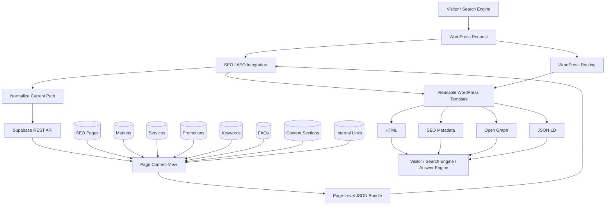
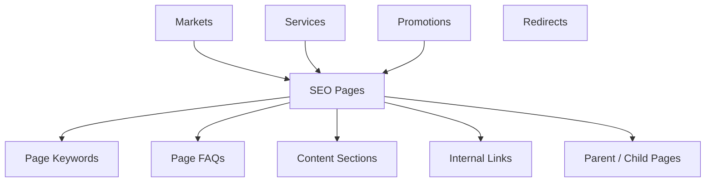
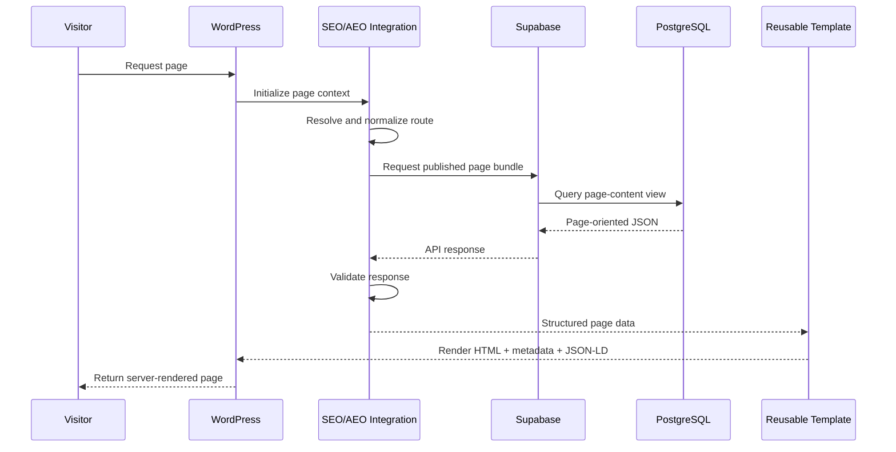

# SEO & AEO Content Platform — System Architecture

## Purpose

The SEO & AEO Content Platform separates localized search content from WordPress presentation logic.

Instead of treating every market page as an independently maintained WordPress content object, the system models pages, hierarchy, SEO metadata, AEO content, FAQs, keywords, content sections, internal links, services, markets, promotions, and redirects as structured data in PostgreSQL.

Supabase exposes that data through a REST layer, while WordPress remains responsible for request handling and presentation.

The core architecture is:

```text
Structured Content Model
        ↓
PostgreSQL / Supabase
        ↓
Page-Oriented JSON
        ↓
WordPress Integration
        ↓
Reusable Templates
        ↓
HTML + SEO Metadata + JSON-LD
```

This document describes the public architecture represented in this repository. Production credentials, private market data, company-specific content, production endpoints, operational rules, and proprietary integrations are intentionally excluded.

---

# 1. High-Level Architecture



The main architectural boundary is:

```text
Database
    ↓
Content + Relationships + Generation

WordPress
    ↓
Request Handling + Presentation
```

---

# 2. Main Components

The platform is divided into four primary layers.

## PostgreSQL Content Model

Responsible for:

- Page identity
- URL paths
- Page hierarchy
- Geographic context
- Technology context
- SEO metadata
- AEO-oriented content
- Keywords
- FAQs
- Content sections
- Internal links
- Services
- Markets
- Promotions
- Redirects
- Publishing state
- Editorial locking

## PL/pgSQL Generation Layer

Responsible for generating repeatable local-page defaults such as:

- SEO titles
- Meta descriptions
- Primary keywords
- H1 content
- Answer-engine summaries
- Key answers
- Keyword records
- FAQ records
- Content sections

## Supabase Delivery Layer

Responsible for:

- Exposing PostgreSQL content through REST
- Returning page-oriented content bundles
- Filtering by route and publication state
- Providing a stable integration boundary for WordPress

## WordPress Integration and Template Layer

Responsible for:

- Reading the current request path
- Normalizing the route
- Fetching the matching page bundle
- Validating API responses
- Falling back safely when structured content is unavailable
- Rendering page content
- Rendering metadata
- Rendering structured data

---

# 3. Page Hierarchy

The page model supports a hierarchical website structure.

```text
Homepage
   ↓
National / Service-Area Landing Page
   ↓
State Page
   ↓
Local Market Page
```

The hierarchy is represented directly in the database.

Important fields include:

```text
parent_page_id
hierarchy_level
geographic_scope
state_code
locality_name
locality_type
technology
```

A page can therefore be understood as more than a URL.

Conceptually:

```text
SEO Page
   │
   ├── Parent Page
   │
   └── Child Pages
```

This hierarchy can support:

- Route organization
- Local content generation
- Internal linking
- State-to-market relationships
- Navigation
- Market-specific behavior

---

# 4. Core Page Record

The main page entity combines route identity, SEO metadata, AEO content, publishing state, hierarchy, and governance.

```text
SEO Page
│
├── Identity
│   ├── page_name
│   ├── page_type
│   ├── slug
│   └── path
│
├── SEO
│   ├── seo_title
│   ├── meta_description
│   ├── primary_keyword
│   ├── canonical_url
│   ├── robots_index
│   └── robots_follow
│
├── Page / AEO
│   ├── h1
│   ├── eyebrow
│   ├── intro_content
│   ├── answer_engine_summary
│   └── key_answer
│
├── Social
│   ├── og_title
│   ├── og_description
│   └── og_image_url
│
├── Publishing
│   ├── status
│   ├── published_at
│   └── active
│
├── Hierarchy
│   ├── parent_page_id
│   ├── hierarchy_level
│   └── geographic_scope
│
├── Local Context
│   ├── state_code
│   ├── locality_name
│   ├── locality_type
│   └── technology
│
└── Governance
    ├── seo_locked
    └── content_generated_at
```

The route path is unique in the page model so one URL maps predictably to one page entity.

---

# 5. Relational Content Model

Repeated and related content is stored separately from the main page record.



This keeps the database normalized while allowing each content type to maintain its own:

- Validation
- Ordering
- Active state
- Metadata
- Relationships
- Publishing behavior

---

# 6. Keyword Model

Keywords are modeled independently from the page.

A keyword record can include:

```text
keyword
keyword_type
search_intent
priority
active
```

This allows the platform to distinguish between keyword roles such as:

```text
Primary
Secondary
Long-tail
Question
```

and search intent such as:

```text
Local
Commercial
Informational
Navigational
```

Priority values can control ordering when the page bundle is assembled.

---

# 7. FAQ / AEO Model

FAQs are structured records rather than hard-coded template content.

A FAQ can contain:

```text
question
short_answer
detailed_answer
answer_type
display_order
include_on_page
include_in_schema
authoritative
source_reference
verified_at
active
```

Two separate controls are important:

```text
FAQ
 ├── include_on_page
 │        ↓
 │    Visible HTML
 │
 └── include_in_schema
          ↓
       JSON-LD
```

This allows visible content and structured-data eligibility to be managed independently.

The additional authority, source, and verification fields support a more deliberate answer-engine content model.

---

# 8. Content Sections

Page body content is modeled as ordered sections.

A section can contain:

```text
section_key
section_type
heading
subheading
content
display_order
active
```

The WordPress template can iterate through these records rather than requiring each content block to be hard-coded.

```text
Page Bundle
    ↓
content_sections[]
    ↓
Order by display_order
    ↓
Reusable Renderer
```

---

# 9. Internal Link Model

Internal links are also modeled as structured relationships.

A link can include:

```text
source_page_id
destination_page_id
destination_url
anchor_text
relationship
priority
active
```

This supports explicit parent, child, and other internal relationships.

Conceptually:

```text
National Page
      ↓ child
State Page
      ↓ child
Local Market Page
      ↑ parent
State Page
```

Internal linking therefore becomes part of the content architecture rather than something that only exists inside manually written HTML.

---

# 10. Redirect Model

Redirects are modeled separately from page content because they serve a different request-management function.

```text
Source Path
    ↓
Redirect Record
    ↓
Redirect Type
    ↓
Destination Path
```

Keeping redirects separate allows URL migrations to be managed without changing the page-content model itself.

---

# 11. Local Content Generation

The platform uses PL/pgSQL functions to create repeatable local SEO/AEO defaults.

The public architecture represents the generation workflow as:

```text
Generate Local Content Bundle
             ↓
 ┌───────────┼────────────┬─────────────┐
 ▼           ▼            ▼             ▼
SEO       Keywords       FAQs        Sections
Defaults
```

Generation begins from structured page context rather than from a completely free-form text prompt.

Relevant context can include:

```text
locality_name
state_code
technology
hierarchy_level
geographic_scope
```

---

# 12. Page Eligibility

Automatic local generation only applies to the intended page class.

```text
Page
 ↓
Correct hierarchy level?
 ↓
geographic_scope = local?
 ↓
Eligible for local generation
```

This prevents local-generation logic from being applied to homepage, national, or state-level pages.

---

# 13. Editorial Locking

The `seo_locked` field protects curated SEO content from automatic replacement.

```text
Local Page
    ↓
seo_locked?
 /         \
Yes         No
 ↓           ↓
Preserve    Generate
Curated     Defaults
Content
```

This creates an important distinction between:

```text
Automatically Generated Defaults
             and
Editorially Curated Content
```

A bulk regeneration process can therefore update eligible pages without overwriting intentionally optimized pages.

---

# 14. Technology-Aware Generation

Local content can respond to structured technology context.

```text
Local Market
     ↓
Technology
 /      |       \
Fiber  Coax   Fiber + Coax
  ↓      ↓         ↓
Technology-Specific
SEO / AEO Content
```

Technology can affect:

- SEO titles
- H1 content
- Primary keywords
- Secondary keywords
- FAQs
- Content sections
- Answer-engine summaries
- Key answers

This lets one content architecture support different local service conditions without requiring separate template systems.

---

# 15. Page Content View

The normalized relational model is ideal for data management, but WordPress benefits from a page-oriented document.

A PostgreSQL view performs that transformation.

```text
seo_pages
   +
seo_markets
   +
seo_services
   +
seo_promotions
   +
seo_page_keywords
   +
seo_page_faqs
   +
seo_content_sections
   +
seo_internal_links
        ↓
Page Content View
        ↓
One JSON Response
```

The view uses PostgreSQL JSONB functions such as:

```text
jsonb_build_object()
jsonb_agg()
COALESCE()
```

Related records are returned as ordered arrays.

Conceptually:

```json
{
  "path": "/national/example-state/example-town/",
  "seo_title": "...",
  "h1": "...",
  "technology": "fiber_coax",
  "keywords": [],
  "faqs": [],
  "content_sections": [],
  "internal_links": []
}
```

This gives the system two useful representations:

```text
Normalized Relational Model
           ↓
     Data Management

Page-Oriented Document
           ↓
   Application Delivery
```

---

# 16. Supabase REST Layer

Supabase exposes the page-oriented view to the WordPress integration.

The front-end read path is intentionally simple:

```text
Current WordPress Path
        ↓
Normalize
        ↓
Supabase REST
        ↓
path = requested path
active = true
status = published
        ↓
Matching Page Bundle
```

The WordPress runtime does not need to know how all of the related PostgreSQL tables are joined.

---

# 17. Request Lifecycle



---

# 18. Path Normalization

The route is the primary lookup key.

A request such as:

```text
/national/example-state/example-town/
```

is normalized before it is sent to Supabase.

The public implementation handles:

- Leading slash
- Trailing slash
- Query-string exclusion
- URL-path extraction

The goal is:

```text
One Logical Route
        ↓
One Stable Lookup Path
```

---

# 19. Safe Failure Design

The SEO/AEO integration enhances WordPress rather than making page rendering depend entirely on one remote request.

```text
Request Structured Page
       ↓
Successful?
   /          \
 Yes           No
  ↓             ↓
Use Bundle   WordPress
             Fallback
```

Fallback behavior can cover:

- Missing configuration
- Network errors
- API errors
- Invalid JSON
- Missing records
- Inactive pages
- Unpublished pages

WordPress fields or existing dynamic data can still provide safe defaults.

---

# 20. WordPress Integration Boundary

The integration layer keeps Supabase-specific behavior out of the template.

The template should not need to know:

- Supabase credentials
- REST syntax
- Authentication headers
- HTTP status codes
- API-response parsing
- Route-query construction

Instead:

```text
WordPress Request
      ↓
SEO Content Client
      ↓
Application-Friendly Page Bundle
      ↓
Template
```

This keeps the template focused on presentation.

---

# 21. Reusable Template Layer

The local template can combine:

```text
Existing WordPress / ACF Data
              +
Supabase SEO / AEO Data
              ↓
Reusable Dynamic Template
```

Supabase can override structured search fields while WordPress continues to provide existing page and market data.

The template can render:

- SEO title
- Meta description
- H1
- Canonical URL
- Robots directives
- Open Graph metadata
- Technology
- Content sections
- FAQs
- JSON-LD

One template can therefore support many local routes.

---

# 22. Structured Data

The structured-data layer uses the same page bundle as the HTML renderer.

The public architecture includes:

```text
WebPage
Service
FAQPage
Question
Answer
```

The flow is:

```text
Page Bundle
     ↓
Metadata
     +
Locality / Technology
     +
Schema-Eligible FAQs
     ↓
JSON-LD Graph
```

Schema eligibility is controlled separately from visible FAQ rendering.

---

# 23. Server-Side Rendering

The final page is rendered through WordPress on the server.

Search engines and answer engines receive the completed HTML output rather than depending on client-side JavaScript to retrieve the core page content.

This keeps:

```text
SEO Metadata
Page Content
FAQs
JSON-LD
```

available in the server-rendered response.

---

# 24. Publishing Model

The front-end integration only retrieves content intended for public use.

Conceptually:

```text
Page Record
    ↓
active = true
    +
status = published
    ↓
Available to WordPress
```

Content creation and maintenance remain separate from the live rendering path.

This separation allows a record to exist without automatically becoming public.

---

# 25. Content Changes vs. Code Changes

One of the main architectural benefits is that content updates and PHP deployments are separate concerns.

```text
Content Update
      ↓
Database Record
      ↓
New Page Bundle
      ↓
WordPress Uses Updated Data
```

does not necessarily require:

```text
Template Change
or
Plugin Deployment
```

Likewise, template improvements can be deployed without manually rebuilding every local content record.

---

# 26. Security Boundary

Production credentials remain outside public source code.

The public integration path should have only the access required to retrieve public-facing page content.

```text
WordPress
   ↓
Read Public SEO/AEO Content
```

It should not require broad administrative access to unrelated database data.

The public repository intentionally excludes:

- Supabase keys
- Database passwords
- WordPress credentials
- Production URLs
- Private environment variables

---

# 27. Input and Output Handling

The request path is external input and is normalized before being used in an API query.

```text
Raw Request
    ↓
Extract URL Path
    ↓
Normalize
    ↓
Encode Query
```

Data returned from the content layer is still escaped according to output context.

Examples:

```text
Plain text → HTML escape
URL        → URL escape
Attribute  → attribute escape
HTML       → controlled WordPress sanitization
```

---

# 28. Performance Model

The public-facing request path is read-oriented:

```text
Request
  ↓
Route Lookup
  ↓
Page Bundle
  ↓
Render
```

The page-content view reduces the need for WordPress to make separate requests for each related content type.

Instead of:

```text
Request Page
Request FAQs
Request Keywords
Request Sections
Request Links
```

the application receives:

```text
One Page Bundle
```

This reduces integration complexity and repeated request overhead.

---

# 29. Scaling Model

Adding another local market does not require a new application architecture.

```text
New Local Page
      ↓
Structured Page Record
      ↓
Generate / Curate Content
      ↓
Existing Page Content View
      ↓
Existing WordPress Integration
      ↓
Existing Template
```

As route count increases, the core rendering architecture remains the same.

Scaling concerns shift toward:

- Content quality
- Validation
- Query performance
- Editorial workflow
- Internal-link quality
- Data maintenance

rather than template duplication.

---

# 30. Testing Strategy

Testing should cover the main architectural boundaries.

## Route Resolution

- Valid path
- Root path
- Trailing slash
- Missing slash
- Query string
- Unexpected request path

## API Integration

- Successful response
- Missing record
- HTTP error
- Timeout
- Invalid JSON
- Missing configuration

## Page Bundle

- Published page
- Inactive page
- Missing optional relationship
- Empty FAQ array
- Empty keyword array
- Empty content-section array

## Generation

- Valid local page
- Invalid hierarchy
- Invalid geographic scope
- Fiber content
- Coax content
- Mixed-technology content
- SEO-locked page

## Rendering

- Supabase SEO override
- WordPress fallback
- Canonical URL
- Robots directives
- Content sections
- Visible FAQs
- Schema-only filtering
- HTML escaping

---

# 31. Public Implementation Examples

The repository includes sanitized code representing the major architecture layers.

```text
examples/
├── supabase-page-content-view.sql
├── local-content-generator.sql
├── seo-content-client.php
├── structured-data-builder.php
├── simplified-local-town-template.php
├── sample-page-record.json
├── sample-api-response.json
└── sample-rendered-page.md
```

Together they demonstrate:

```text
Relational Page Record
        ↓
Database Generation
        ↓
Related Content
        ↓
Page Content View
        ↓
Supabase REST
        ↓
WordPress Route Client
        ↓
Reusable Template
        ↓
Structured Data Builder
        ↓
Rendered Page
```

---

# 32. Architectural Principles

## Keep Content Separate From Presentation

Localized search content should not be hard-coded into each WordPress template.

## Model the Website Hierarchy Explicitly

Parent relationships and geographic scope should exist in structured data rather than only in URL conventions.

## Keep Normalized Storage and Application Delivery Separate

PostgreSQL can remain relational while WordPress receives a page-oriented JSON document.

## Use Deterministic Generation for Repeatable Defaults

Local content generation should be predictable and based on structured page context.

## Preserve Editorial Control

Automation should not overwrite intentionally curated SEO content.

## Keep the Template Reusable

Adding a market should not require duplicating the presentation layer.

## Fail Gracefully

A content lookup failure should not automatically break the website.

## Keep Secrets Outside Source Control

Production credentials belong in configuration, not public repositories.

## Render Safely

Structured data still requires context-appropriate sanitization and escaping.

---

# 33. Public Documentation Scope

This repository intentionally demonstrates:

- Hierarchical page modeling
- Relational SEO/AEO content modeling
- PostgreSQL
- PL/pgSQL
- Technology-aware local generation
- Editorial locking
- Keywords
- FAQs
- Content sections
- Internal links
- Redirect architecture
- PostgreSQL JSONB aggregation
- Page-oriented database views
- Supabase REST integration
- Route-based WordPress lookup
- Safe fallback behavior
- Reusable templates
- SEO metadata
- AEO-oriented content
- JSON-LD generation
- Security boundaries
- Testing concepts

It intentionally excludes:

- Production credentials
- Production Supabase URLs
- Private database access
- Real market datasets
- Real promotion and pricing information
- Company-specific content
- Private operational integrations
- Production infrastructure configuration
- Internal business rules

---

# Summary

The SEO & AEO Content Platform is a structured content system built around WordPress rather than a collection of individually maintained search pages.

```text
Website Hierarchy
        ↓
PostgreSQL Content Model
        ↓
PL/pgSQL Generation
        ↓
Relational SEO / AEO Content
        ↓
Page Content View
        ↓
Supabase REST
        ↓
WordPress Route Resolution
        ↓
Reusable Template
        ↓
HTML + SEO Metadata + JSON-LD
```

The architecture connects marketing content strategy with database design, automation, APIs, and reusable application logic while keeping WordPress focused on presentation.
