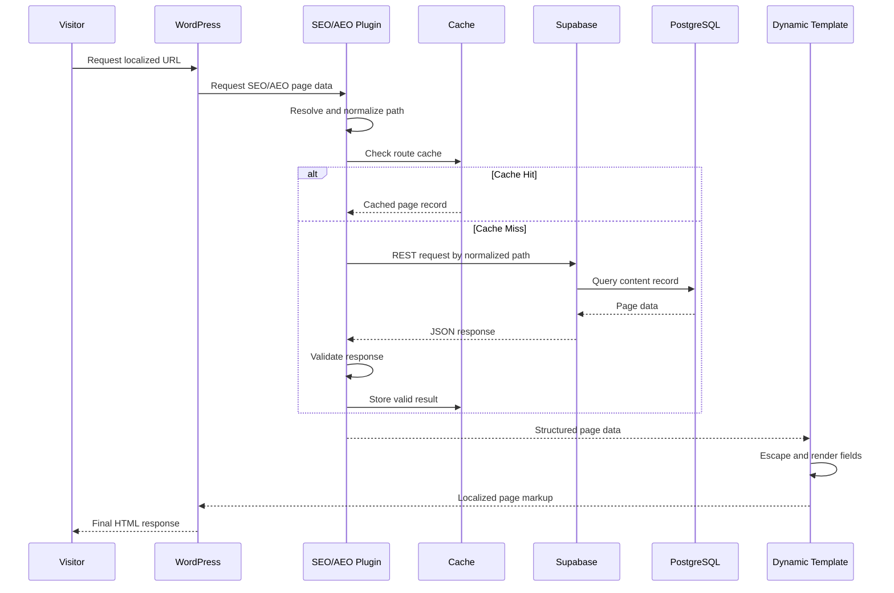

# SEO & AEO Content Platform — Technical Overview

## Introduction

The SEO & AEO Content Platform is a database-driven content system that connects WordPress to structured SEO/AEO records stored in Supabase/PostgreSQL.

The production website uses WordPress for page delivery and reusable templates, while a custom PHP plugin retrieves route-specific content from Supabase based on the current request path.

The goal is to make localized service pages easier to manage at scale without hard-coding market-specific SEO content directly into each page template.

This document focuses on implementation concepts and engineering decisions. Production credentials, exact table schemas, private endpoints, proprietary content, internal market data, and company-specific rules are intentionally excluded.

---

## 1. Technology Stack

| Area | Technology | Responsibility |
|---|---|---|
| CMS | WordPress | Page routing and rendering |
| Integration Layer | PHP | Custom SEO/AEO plugin |
| Data Store | Supabase / PostgreSQL | Structured page content |
| API Layer | Supabase REST API | Content retrieval |
| Front End | WordPress Templates / HTML / CSS | Page presentation |
| Configuration | WordPress / Environment Config | API URL, keys, options |
| Data Model | SQL / PostgreSQL | Route-driven content records |
| Content Strategy | SEO / AEO | Search and answer-oriented content |

---

## 2. Core Request Model

The live request flow is:

```text
Visitor requests localized URL
        ↓
WordPress resolves page
        ↓
Custom plugin inspects request path
        ↓
Path is normalized
        ↓
Supabase request is generated
        ↓
Matching content record is returned
        ↓
Response is validated
        ↓
Template receives structured page data
        ↓
Localized page is rendered
```

The key design principle is that the URL route acts as the link between WordPress and the structured content record.

---

## 3. Plugin Bootstrap

A custom WordPress plugin provides the integration layer.

A basic plugin begins with a standard header and WordPress safety check:

```php
<?php
/**
 * Plugin Name: SEO & AEO Content Engine
 * Description: Retrieves structured SEO and AEO page content.
 * Version: 1.0.0
 */

if (!defined('ABSPATH')) {
    exit;
}
```

The production plugin includes additional logic that is not published in the showcase.

---

## 4. Separation of Responsibilities

The plugin is easier to maintain when responsibilities are separated into functions.

Conceptually:

```text
Plugin
├── Configuration
├── Current Path Resolver
├── Path Normalizer
├── API Client
├── Response Validator
├── Page Data Accessor
├── Cache Layer
└── Error / Logging Layer
```

This avoids turning the plugin into one large procedural block.

---

## 5. Current Path Resolution

The plugin needs to determine the path being requested.

Conceptually:

```php
function seo_get_current_path() {
    $uri = $_SERVER['REQUEST_URI'] ?? '/';

    $path = parse_url($uri, PHP_URL_PATH);

    return $path ?: '/';
}
```

The actual production implementation may use WordPress routing helpers or additional handling.

---

## 6. Why the Path Matters

The page path is the lookup key.

For example:

```text
/national/pennsylvania/example-fiber/
```

maps to one structured content record.

The route therefore becomes part of the content data model.

---

## 7. Path Normalization

Paths need to be normalized before querying the data store.

Typical normalization can include:

- Remove query strings
- Ensure leading slash
- Apply consistent trailing slash policy
- Lowercase where appropriate
- Remove duplicate slashes
- Decode or normalize URL characters
- Trim whitespace

Conceptually:

```php
function seo_normalize_path($path) {
    $path = trim($path);
    $path = '/' . ltrim($path, '/');

    if ($path !== '/') {
        $path = rtrim($path, '/') . '/';
    }

    return strtolower($path);
}
```

The production rules may differ depending on how routes are stored.

---

## 8. Stable Route Keys

A route-based architecture works best when the database uses a predictable normalized path.

Conceptually:

```text
Database path:
/national/pennsylvania/example-fiber/

Incoming request:
/national/pennsylvania/example-fiber/

Result:
exact match
```

Without normalization, logically identical routes can fail to match.

---

## 9. Supabase Configuration

Connection information should not be hard-coded into public source files.

Conceptually:

```php
define('SEO_SUPABASE_URL', getenv('SEO_SUPABASE_URL'));
define('SEO_SUPABASE_KEY', getenv('SEO_SUPABASE_KEY'));
```

or through protected WordPress configuration.

The public repository should never contain real production credentials.

---

## 10. Configuration Validation

Before calling the API, the plugin should verify required configuration exists.

Conceptually:

```php
if (
    !defined('SEO_SUPABASE_URL') ||
    !defined('SEO_SUPABASE_KEY')
) {
    return null;
}
```

A missing configuration value should generate a controlled failure rather than a fatal error.

---

## 11. API Request Construction

The plugin builds a request against the structured content source.

Conceptually:

```php
$url = SEO_SUPABASE_URL
    . '/rest/v1/seo_pages'
    . '?path=eq.'
    . rawurlencode($path)
    . '&limit=1';
```

This example is simplified.

The production implementation may query a table, view, RPC function, or another secured endpoint.

---

## 12. WordPress HTTP API

WordPress provides its own HTTP client functions.

A public-safe example:

```php
$response = wp_remote_get(
    $url,
    [
        'headers' => [
            'apikey' => SEO_SUPABASE_KEY,
            'Authorization' => 'Bearer ' . SEO_SUPABASE_KEY,
        ],
        'timeout' => 5,
    ]
);
```

Using the WordPress HTTP API avoids relying directly on PHP cURL configuration.

---

## 13. Request Timeout

A defined timeout prevents a slow external service from indefinitely delaying page rendering.

Conceptually:

```text
Request Supabase
      ↓
Response within timeout?
   /          \
 Yes          No
  ↓            ↓
Continue     Fallback
```

Timeout behavior is especially important for a public website.

---

## 14. HTTP Error Handling

A request can fail before valid JSON is returned.

The plugin should distinguish between:

- Transport error
- Timeout
- Authentication error
- HTTP 4xx
- HTTP 5xx
- Valid response with no matching record

Conceptually:

```php
if (is_wp_error($response)) {
    return null;
}

$status = wp_remote_retrieve_response_code($response);

if ($status < 200 || $status >= 300) {
    return null;
}
```

---

## 15. JSON Parsing

Supabase returns structured JSON.

Conceptually:

```php
$body = wp_remote_retrieve_body($response);
$data = json_decode($body, true);
```

The plugin should verify decoding succeeded before using the data.

---

## 16. Response Shape Validation

A successful HTTP response does not automatically mean the payload is valid.

The plugin should verify:

```text
Response is an array
At least one record exists
Expected keys exist
Required values are usable
```

Conceptually:

```php
if (!is_array($data) || empty($data)) {
    return null;
}

$page = $data[0];
```

---

## 17. Required vs Optional Fields

The page model should distinguish between required fields and optional fields.

Example:

```text
Required
├── path
├── seo_title
└── h1

Optional
├── intro
├── faq
├── technology
├── metadata
└── additional sections
```

Optional fields should not break rendering when absent.

---

## 18. Public Page Data Function

The plugin can expose one clean function to the template layer.

Conceptually:

```php
function seo_get_page_data() {
    $path = seo_get_current_path();
    $path = seo_normalize_path($path);

    return seo_fetch_page($path);
}
```

This keeps template code simple.

---

## 19. Template Consumption

The template receives structured data without needing to understand Supabase.

Conceptually:

```php
$page = seo_get_page_data();

if ($page) {
    echo esc_html($page['h1']);
}
```

That clean boundary is one of the most important implementation decisions.

---

## 20. Template Independence

The WordPress template should not need to know:

- API URLs
- Supabase authentication
- Query syntax
- HTTP status handling
- JSON parsing
- Retry behavior

It should only work with application-friendly page data.

---

## 21. SEO Title Integration

A structured record can provide the SEO title for the current route.

Conceptually:

```php
$page['seo_title']
```

The plugin or theme can then integrate that value with the WordPress title-generation process.

---

## 22. H1 Rendering

The primary heading can be data-driven:

```php
<h1>
    <?php echo esc_html($page['h1']); ?>
</h1>
```

Escaping is important even when the content source is controlled.

---

## 23. Structured Content Sections

Instead of storing one large block of HTML, content can be divided into fields.

For example:

```text
intro
service_summary
technology_summary
local_context
faq
cta
```

This makes it easier to reuse and render content selectively.

---

## 24. FAQ Storage

FAQs can be stored as structured JSON.

Example:

```json
[
  {
    "question": "What service is available?",
    "answer": "Availability depends on the exact service address."
  },
  {
    "question": "How do I check availability?",
    "answer": "Enter your address or contact the service team."
  }
]
```

This format is easier to render consistently than freeform HTML.

---

## 25. FAQ Rendering

Conceptually:

```php
if (!empty($page['faqs'])) {
    foreach ($page['faqs'] as $faq) {
        // Render question and answer.
    }
}
```

The template can control the HTML structure.

---

## 26. Structured Data / Schema Support

Structured FAQ data can also support JSON-LD generation.

Conceptually:

```text
FAQ Record
    ↓
HTML FAQ
    +
FAQPage JSON-LD
```

The architecture makes this easier because questions and answers already exist as structured data.

---

## 27. AEO-Oriented Content

Answer-oriented content benefits from structured fields such as:

```text
Direct Answer
Question
Answer
Service Description
Availability Explanation
Technology Explanation
```

This makes the system better suited to answer engines than a single large content blob.

---

## 28. Market-Specific Content

Localized pages can vary by:

- City
- State
- Market
- Service technology
- Offer context
- Service availability
- Local FAQs
- Local headings

The content database carries these differences while the template stays reusable.

---

## 29. Technology-Aware Rendering

The content record can include a technology field.

Conceptually:

```php
switch ($page['technology']) {
    case 'fiber':
        // Fiber-specific rendering.
        break;

    case 'coax':
        // Coax-specific rendering.
        break;
}
```

The production values and behavior are private.

---

## 30. Existing Dynamic WordPress Data

The SEO/AEO layer can coexist with existing ACF or spreadsheet-driven data.

Conceptually:

```text
Existing Dynamic Data
       +
Supabase SEO/AEO Data
       ↓
WordPress Template
```

This is useful when the site already has operational or service data coming from another source.

---

## 31. Data Merge Strategy

The template may combine data from multiple systems.

Conceptually:

```text
Page Identity
+
Market / Service Data
+
SEO/AEO Content
+
Offer / Product Data
        ↓
Rendered Page
```

The plugin should keep its own responsibility narrow: retrieve and provide SEO/AEO content.

---

## 32. Missing Record Behavior

A missing Supabase record is not necessarily an application error.

Conceptually:

```text
Route exists in WordPress
      ↓
SEO/AEO record exists?
   /        \
 Yes        No
  ↓          ↓
Use Data   Continue safely
```

The site can still render using existing page data or fallback content.

---

## 33. Fallback Content

A fallback might come from:

- WordPress page content
- ACF fields
- A generic template value
- Default metadata
- Existing dynamic source

The production fallback behavior is private.

---

## 34. Avoiding Fatal Dependencies

The external content system should enhance the site, not become a single point of failure.

Bad behavior:

```text
Supabase unavailable
        ↓
Entire page crashes
```

Preferred behavior:

```text
Supabase unavailable
        ↓
Log failure
        ↓
Use fallback
        ↓
Page still renders
```

---

## 35. Logging

Useful operational logs can include:

```text
Timestamp
Path
Lookup result
HTTP status
Timeout
Missing record
Invalid response
Missing configuration
```

Sensitive keys and full private payloads should not be logged.

---

## 36. Debug Mode

A development-only debug mode can display or log additional information.

For example:

```text
Current Path
Matched Record
Technology
SEO Title
H1
```

Debug output should never expose credentials.

---

## 37. Development Connectivity Test

A simple test endpoint or temporary debug block can verify:

```text
WordPress can reach Supabase
Path resolves correctly
Matching record exists
Expected fields are returned
```

Temporary diagnostics should be removed once the integration is verified.

---

## 38. Caching

Fetching the same content repeatedly can create unnecessary API traffic.

A WordPress transient can conceptually cache route data:

```php
$key = 'seo_page_' . md5($path);

$cached = get_transient($key);

if ($cached !== false) {
    return $cached;
}
```

---

## 39. Writing to Cache

After a successful lookup:

```php
set_transient(
    $key,
    $page,
    15 * MINUTE_IN_SECONDS
);
```

The exact production TTL depends on how quickly content changes.

---

## 40. Cache Duration Tradeoff

```text
Short TTL
  → Fresher content
  → More API calls

Long TTL
  → Faster / fewer calls
  → Slower updates
```

A reasonable TTL depends on editorial frequency.

---

## 41. Negative Caching

Repeated requests for a missing route can also create unnecessary database traffic.

A short negative cache can reduce repeated failed lookups.

Care must be taken not to keep newly published routes hidden for too long.

---

## 42. Cache Invalidation

Possible invalidation methods include:

- TTL expiration
- Manual cache clear
- Publish-time invalidation
- Deployment invalidation
- Administrative tooling

---

## 43. Supabase Query Performance

The route lookup should be supported by an index.

Conceptually:

```sql
CREATE INDEX idx_seo_pages_path
ON seo_pages(path);
```

This is illustrative only.

---

## 44. Unique Route Constraint

A normalized route should normally identify a single page record.

Conceptually:

```sql
ALTER TABLE seo_pages
ADD CONSTRAINT seo_pages_path_unique
UNIQUE (path);
```

This prevents ambiguous lookups.

---

## 45. Content Status

A record can conceptually include a status such as:

```text
draft
review
published
archived
```

The live API query can limit results to publishable content.

---

## 46. Publish Filtering

Conceptually:

```sql
SELECT *
FROM seo_pages
WHERE path = :path
  AND status = 'published'
LIMIT 1;
```

The exact production workflow may differ.

---

## 47. Content Versioning

As the system grows, useful metadata can include:

```text
created_at
updated_at
published_at
content_version
```

This helps with auditing and troubleshooting.

---

## 48. Schema Evolution

New content requirements may require additional fields.

A controlled migration flow can be:

```text
Add field
   ↓
Update existing records
   ↓
Update plugin data model
   ↓
Update template
   ↓
Deploy
```

---

## 49. Backward Compatibility

Templates should tolerate newly optional fields being absent from older records.

Conceptually:

```php
$intro = $page['intro'] ?? '';
```

This prevents schema changes from immediately breaking old pages.

---

## 50. PostgreSQL Data Types

Different content structures can use different PostgreSQL types.

Examples:

```text
text
varchar
boolean
jsonb
timestamp
integer
```

JSONB can be useful for repeated content blocks such as FAQs.

---

## 51. JSONB Validation

Structured JSON should still be validated before rendering.

Conceptually:

```text
JSON exists
    ↓
Expected array?
    ↓
Expected keys?
    ↓
Render
```

Malformed JSON content should not break the page.

---

## 52. Input Sanitization

The route originates from an HTTP request and should be treated as input.

The plugin should:

- Strip irrelevant query strings
- Normalize path syntax
- Encode query values
- Avoid concatenating unsafe SQL
- Use the API filter model safely

---

## 53. Output Escaping

Output should use WordPress escaping functions appropriate to the context.

Examples:

```php
esc_html()
esc_attr()
esc_url()
wp_kses_post()
```

The correct function depends on whether the field contains plain text, an attribute, a URL, or controlled HTML.

---

## 54. Plain Text vs HTML Fields

A strong data model explicitly knows whether a field is:

```text
Plain text
Controlled rich text
URL
Structured JSON
```

This makes rendering safer.

---

## 55. WordPress Hooks

Depending on the implementation, the plugin can integrate with hooks such as:

```text
init
wp
template_redirect
wp_head
document_title_parts
the_content
shortcode hooks
custom template helpers
```

The correct hook depends on when the data is needed.

---

## 56. Title Hooking

If the plugin controls the SEO title, it may integrate with WordPress title filters.

Conceptually:

```php
add_filter('document_title_parts', function ($title) {
    // Replace title using route-specific data.
    return $title;
});
```

The production implementation may integrate with a separate SEO plugin instead.

---

## 57. Avoiding Repeated API Calls

If several hooks request the same page record in one WordPress request, the plugin should avoid calling Supabase each time.

A simple request-level cache can help.

Conceptually:

```php
static $page_data = null;
```

---

## 58. Request-Level Memoization

The flow becomes:

```text
First request for page data
      ↓
Fetch from cache/API
      ↓
Store in memory
      ↓
Later hook asks again
      ↓
Reuse same data
```

This reduces redundant work.

---

## 59. REST Authentication

Supabase access typically requires API headers.

The key used by the public-facing application should have the minimum privileges required.

Public website rendering should not require an unrestricted administrative key.

---

## 60. Row-Level Security

Supabase/PostgreSQL can use Row Level Security to control access.

A public read-oriented content table can expose only approved records while keeping administrative or draft data protected.

The exact production policy is private.

---

## 61. Least Privilege

The WordPress integration should only be able to:

```text
Read approved SEO/AEO page data
```

It should not require:

```text
Modify unrelated tables
Delete data
Administer database
Access private customer information
```

---

## 62. Secret Rotation

Separating credentials from source code makes key rotation easier.

A key can be changed in configuration without rewriting plugin code or exposing the new value in Git history.

---

## 63. Environment Separation

Development and production should use separate configuration.

Conceptually:

```text
Development WordPress
      ↓
Development Supabase

Production WordPress
      ↓
Production Supabase
```

This reduces the risk of test activity affecting live content.

---

## 64. Local Testing

The plugin can be tested against:

- Test routes
- Synthetic page records
- Development Supabase
- Mock HTTP responses
- WordPress staging

---

## 65. API Mocking

Unit tests can mock:

```text
Successful Supabase response
Empty response
HTTP 401
HTTP 500
Timeout
Malformed JSON
```

This allows failure behavior to be tested without relying on a live API.

---

## 66. Route Tests

Important route cases include:

```text
/
/national/example/
/national/example
/national/example/?test=1
/NATIONAL/EXAMPLE/
```

All should normalize according to one consistent policy.

---

## 67. Rendering Tests

A rendering test can verify:

```text
SEO title appears correctly
H1 appears correctly
Optional content renders when present
Missing optional content does not break page
FAQ array renders expected number of items
```

---

## 68. Security Tests

Tests can also verify:

- HTML is escaped
- URLs are validated
- Credentials are not present in output
- Unexpected path characters are handled
- API errors do not expose private details

---

## 69. Performance Testing

Useful measurements include:

```text
Supabase response time
WordPress total render time
Cache hit rate
Cache miss rate
API calls per page request
```

These help identify bottlenecks.

---

## 70. Search Engine Considerations

The content is rendered server-side through WordPress.

That means search crawlers receive the completed HTML response rather than relying entirely on client-side JavaScript to fetch core SEO content.

---

## 71. Canonical Route Discipline

A route-driven data model works best when the website has one canonical version of each page.

Duplicate paths, unnecessary aliases, or inconsistent slash behavior can complicate both SEO and content lookup.

---

## 72. Internal Linking

A structured content system can later support route relationships such as:

```text
State page
   ↓
City pages
   ↓
Technology pages
```

This can be used to build consistent internal linking.

---

## 73. Structured Data Generation

Because content is stored in fields, structured data can be generated programmatically.

Potential schema types can include:

- FAQPage
- Service
- Organization-related markup
- BreadcrumbList

The exact schema strategy depends on the page.

---

## 74. Avoiding Duplicate Schema

If another WordPress SEO plugin already outputs structured data, the custom platform should avoid blindly generating conflicting duplicates.

Integration needs to account for the rest of the WordPress stack.

---

## 75. Content Quality Controls

Useful automated checks can include:

```text
SEO title missing
SEO title too long
H1 missing
Duplicate route
Empty FAQ
Missing technology
Unpublished content on live route
```

The system can evolve toward stronger content QA over time.

---

## 76. Database-Driven Auditing

A database makes it easier to query content quality.

Conceptually:

```sql
SELECT path
FROM seo_pages
WHERE seo_title IS NULL
   OR h1 IS NULL;
```

This is far easier than manually opening hundreds of WordPress pages.

---

## 77. Bulk Content Operations

Structured records also make bulk updates possible.

Examples:

```text
Update terminology
Change technology labels
Add required field
Refresh FAQ structure
Correct metadata pattern
```

This can be done through controlled database or admin workflows rather than individual page edits.

---

## 78. Content Import

A scalable content platform can support structured imports from:

- CSV
- Spreadsheet
- Internal database
- Data-generation workflow
- Controlled AI-assisted workflow

Imported content should still pass validation before publication.

---

## 79. AI-Assisted Content

The architecture can support AI-assisted content generation without making AI the live page renderer.

A safer model is:

```text
Data / Market Context
      ↓
AI Draft
      ↓
Review / Validation
      ↓
Structured Database Record
      ↓
Published Page
```

This preserves human and system control over published content.

---

## 80. AEO Feedback Loop

Future optimization can connect:

```text
User Questions
Search Queries
AI Answer Visibility
Page Performance
        ↓
Content Update
```

Because the content is structured, updates can target individual sections rather than entire page rewrites.

---

## 81. Troubleshooting: No Data Returned

When a page renders without expected SEO/AEO content, the troubleshooting sequence can be:

```text
Check current path
      ↓
Check normalized path
      ↓
Verify configuration
      ↓
Test Supabase connectivity
      ↓
Confirm record exists
      ↓
Inspect API response
      ↓
Check template access
```

This isolates the failure quickly.

---

## 82. Troubleshooting: Connected but Not Rendering

A successful API test does not prove the template is actually using the returned data.

If the connection works but the page does not change, verify:

- Plugin function is called
- Correct hook/template is active
- Page data is passed into rendering
- Existing dynamic template is not overriding it
- Cache is not serving old content

---

## 83. Troubleshooting: Wrong Page Data

If the wrong market content appears, investigate:

```text
Route normalization
Duplicate path records
Cache key
Canonical route
Query filters
```

---

## 84. Troubleshooting: Stale Data

If Supabase contains updated content but WordPress shows old content:

```text
Check WordPress transient
Check object cache
Check CDN cache
Check page cache
Check browser cache
```

Several layers may cache the same rendered result.

---

## 85. Troubleshooting: Intermittent Failures

Intermittent issues can be caused by:

- API latency
- Short timeout
- Hosting network problems
- Rate limits
- Caching inconsistency
- temporary Supabase issues

Logging response time and failure category helps distinguish these.

---

## 86. Content and Code Deployment Separation

The platform benefits from two independent workflows.

```text
Code change
    → Plugin / Theme deployment

Content change
    → Supabase record update
```

Content editors do not need a code deployment for every SEO update.

---

## 87. Migration Safety

When code expects a new database field, deployment order matters.

A safer sequence is:

```text
Add database field
      ↓
Backfill data
      ↓
Deploy compatible plugin/template
      ↓
Begin using new field
```

This reduces production errors.

---

## 88. Feature Flags

New behavior can be introduced behind configuration.

Conceptually:

```text
ENABLE_NEW_FAQ_RENDERER=true
```

Feature flags can reduce risk when rolling out major template changes.

---

## 89. Maintainability

The system is easier to maintain when the plugin keeps clear boundaries:

```text
Configuration
Route Logic
API Client
Data Validation
Cache
Rendering Helpers
Logging
```

This makes debugging and future changes more predictable.

---

## 90. Scalability

Adding more localized pages should primarily mean adding more structured data.

The architecture itself stays largely unchanged.

```text
More Markets
      ↓
More Records
      ↓
Same Plugin
      ↓
Same Template Architecture
```

This is the main scalability advantage.

---

## 91. Database Scaling

As the page count grows, important database concerns include:

- Indexed route lookup
- Unique path constraint
- Small API response size
- Published-content filtering
- Efficient JSON fields
- Query monitoring

---

## 92. WordPress Scaling

On the WordPress side:

- Cache page data
- Reuse API results within one request
- Avoid expensive logic in repeated hooks
- Keep API timeouts bounded
- Fail gracefully

---

## 93. CDN and Page Cache

Because localized pages are mostly read-oriented, full-page caching can provide significant performance benefits.

The content API may only be called when a cached page expires or is invalidated.

---

## 94. Content Freshness Strategy

The system needs to decide how quickly a Supabase content change should appear publicly.

Possible approaches:

```text
Immediate
Near-real-time
Within cache TTL
Manual publish / purge
```

The right choice depends on business needs.

---

## 95. Audit Fields

Useful record metadata can include:

```text
created_at
updated_at
published_at
updated_by
content_version
```

These fields support operational visibility.

---

## 96. Content Ownership

A structured content system can also assign ownership or review responsibility to records.

This becomes helpful as the number of localized pages grows.

---

## 97. Public Showcase Boundaries

This repository should demonstrate the system without exposing production implementation details.

Safe to show:

- Conceptual PHP
- Architecture
- Data model examples
- Route logic
- Failure handling
- Caching strategy
- Security principles
- Synthetic records

Not safe to show:

- Production API keys
- Supabase service-role credentials
- Internal market database
- Exact private URLs
- Proprietary page content
- Full production schemas
- Internal business rules

---

## 98. Why This Is a Platform

The project is more than a plugin because it combines:

```text
WordPress
+
PHP Integration
+
PostgreSQL Data Modeling
+
Supabase API
+
Route Resolution
+
Dynamic Templates
+
Structured SEO/AEO Content
+
Caching
+
Security
+
Operational Error Handling
```

The plugin is the connector; the platform is the full system.

---

## 99. End-to-End Technical Flow



---

## 100. Technical Challenges Solved

### Local Pages Needed Unique Content

**Problem:** A reusable template still needs route-specific titles, headings, FAQs, and content.  
**Solution:** Store route-specific records in Supabase and retrieve them by path.

### Content Was Too Closely Coupled to WordPress

**Problem:** Editing individual pages does not scale well.  
**Solution:** Separate structured content from presentation.

### The Site Already Used Dynamic Templates

**Problem:** The new SEO system had to work with an existing dynamic page architecture.  
**Solution:** Add SEO/AEO as a separate data layer instead of replacing the whole page system.

### External Data Could Fail

**Problem:** A network/API issue should not break a public website.  
**Solution:** Use bounded timeouts, response validation, logging, caching, and safe fallbacks.

### Many Pages Need Consistent Structure

**Problem:** Manual page editing can create inconsistent metadata and headings.  
**Solution:** Use a structured schema and reusable template.

### Content Updates Should Not Require Code Changes

**Problem:** Marketing content changes frequently.  
**Solution:** Keep content in the database and code in the plugin/template layer.

---

## 101. Engineering Principles

### Keep Data Separate From Presentation

The template renders content but does not own the market-specific data.

### Normalize Before Querying

The URL path must be predictable before it is used as a lookup key.

### Fail Gracefully

An external API problem should not become a full-page outage.

### Cache Repeated Reads

Localized content changes much less often than it is read.

### Escape at Render Time

Even trusted content should be handled according to its output context.

### Use Least Privilege

The public site needs read access, not administrative database control.

### Make Content Structured

Structured fields are easier to validate, render, reuse, and optimize.

---

## Public Documentation Scope

This technical overview intentionally includes:

- PHP plugin structure
- WordPress request handling
- Route normalization
- Supabase REST requests
- Response validation
- PostgreSQL content modeling
- Dynamic template integration
- FAQ/JSON structures
- Caching
- Security
- Error handling
- Testing
- Performance
- Troubleshooting
- Scaling

It intentionally excludes:

- Production credentials
- Production Supabase endpoints
- Exact database schema
- Proprietary SEO/AEO content
- Internal market records
- Production WordPress configuration
- Private queries
- Company-specific publishing rules

---

## Summary

The SEO & AEO Content Platform uses WordPress as the presentation layer and Supabase/PostgreSQL as a structured content layer.

```text
Localized URL
      ↓
Route Normalization
      ↓
Custom WordPress Plugin
      ↓
Cache / Supabase REST API
      ↓
Structured SEO/AEO Record
      ↓
Response Validation
      ↓
Reusable Dynamic Template
      ↓
Server-Rendered Localized Page
```

The system turns what would traditionally be a large collection of individually maintained WordPress pages into a route-driven content platform with reusable templates, centralized structured data, API-based retrieval, and controlled production behavior.
